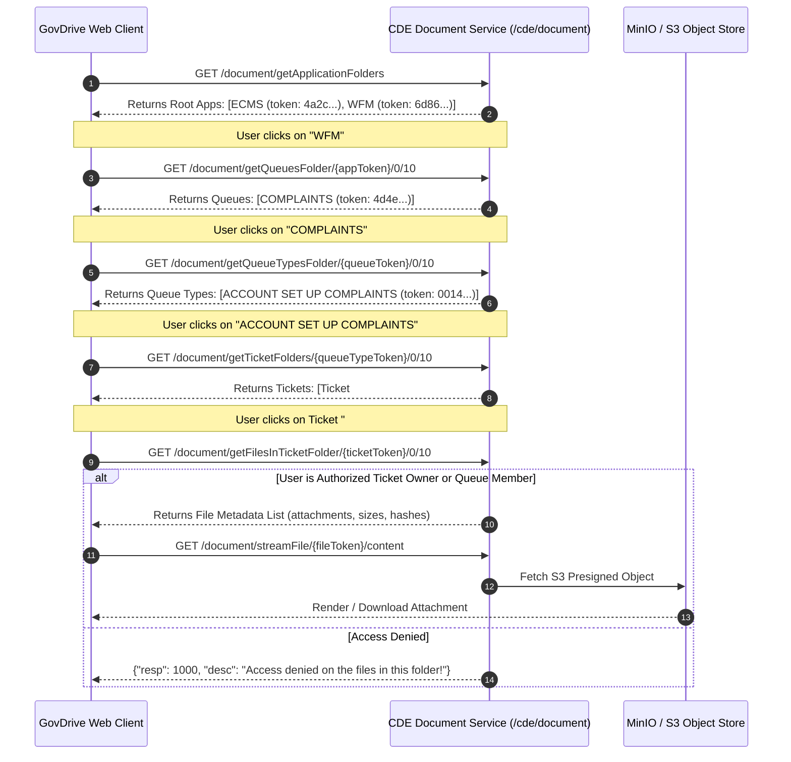

# Enterprise Architectural Blueprint: "Application Documents" Module
## Deep-Dive Analysis of 1Gov Drive & Commercial Tailoring for CICOD cDrive

---

## 1. Executive Summary & Purpose of the Application Module

In complex enterprise and public-sector environments, documents rarely originate solely from manual user uploads. Instead, the vast majority of mission-critical files originate inside **satellite operational applications**:
- **Work Orders & Field Operations (WFM / cFlow)**: Customer fault reports, photographic site evidence, diagnostic logs, technician sign-off sheets, and equipment inspection certificates.
- **Executive Correspondence & Approvals (ECMS / Memos)**: Ministerial memos, financial authorization vouchers, circulars, executive decrees, and procurement tender boards.

### The Problem It Solved in 1Gov
Prior to having the **"Application Documents"** module:
- Files uploaded inside tickets or memos were locked in database BLOB columns or proprietary storage silos.
- If a supervisor or auditor needed to review all attachments for an agency or case type, they had to log into multiple disparate applications.
- Civil servants would manually re-upload files to their personal drives, creating duplicate, untracked, and insecure copies.

### The 1Gov Solution
1Gov Drive created an automated ingestion pipeline where **ECMS** and **WFM** automatically provision system folders and push attachments directly into GovDrive under **"Application Documents"**.

---

## 2. Under the Hood: Reverse-Engineered Technical Architecture

Through deep inspection of the production client bundles (`9534-24b649f03d5c8769.js` and `page-50ddae6088db6a9a.js`) combined with live authenticated API probing on `govtest.convergenceondemand.com`, we uncovered the complete mechanics and data flow of the module.

### 2.1 The 4-Tier Structural Hierarchy

The module is engineered around a rigid 4-tier tree:

```
[Level 0: Root] Application Folders (ECMS, WFM)
      │
      └──► [Level 1: Queues] High-Level Service Queues (e.g. COMPLAINTS, 1GOV TEST)
            │
            └──► [Level 2: Queue Types] Specific Issue Categories (e.g. ACCOUNT SET UP COMPLAINTS)
                  │
                  └──► [Level 3: Ticket / Case Folders] Unique Ticket IDs (e.g. #15747, #15787)
                        │
                        └──► [Level 4: Files] Actual Document Payloads (PDFs, Images, Docs)
```

### 2.2 Live API Endpoints & Request Cycle



### 2.3 Live Data Samples Captured from `govtest`

#### Level 0: Root Applications
```json
{
  "resp": 0,
  "desc": "Successful",
  "object": [
    {
      "id": 29,
      "folderName": "ecms",
      "folderDisplayName": "ECMS",
      "folderToken": "4a2cbee0-6499-4cad-b006-cf2636c3587b",
      "folderPath": "100003/ecms/",
      "folderDisplayStatus": "APPLICATION",
      "createdBy": { "firstName": "Ann", "lastName": "Nya", "roleName": "System Admin" }
    },
    {
      "id": 35,
      "folderName": "wfm",
      "folderDisplayName": "WFM",
      "folderToken": "6d86a139-01b8-421d-b80d-1fe2f3aaa2e5",
      "folderPath": "100003/wfm/",
      "folderDisplayStatus": "APPLICATION",
      "createdBy": { "firstName": "Ann", "lastName": "Nya", "roleName": "System Admin" }
    }
  ]
}
```

#### Level 1: Queues (Under WFM)
- Queue Name: `complaints` (`COMPLAINTS`)
- Folder Token: `4d4ec0a6-2be7-498a-9aa5-7f0d0ae7ff50`
- Folder Path: `100003/wfm/complaints/`

#### Level 2: Queue Types (Under COMPLAINTS)
- Queue Type Name: `account set up complaints` (`ACCOUNT SET UP COMPLAINTS`)
- Folder Token: `0014fd92-d492-4866-98a4-128e1943a606`
- Folder Path: `100003/wfm/complaints/account set up complaints/`

#### Level 3: Tickets (Under ACCOUNT SET UP COMPLAINTS)
- Ticket Folder Name: `15747`
- Folder Token: `cfa8ed59-c529-4c22-ba9f-660aa00208f4`
- Created By: User `Adedero Cosmos` (`adedero.cosmos@cicod.com`)
- Folder Path: `100003/wfm/complaints/account set up complaints/15747/`

#### Level 4: File Permissions & Security
- Unlike general folders where permissions are set via link sharing or email invites, Ticket Folders inherit their ACL from the parent satellite application:
  - If the logged-in user is **not** the ticket creator, the assigned engineer, or in the department queue, `getFilesInTicketFolder` returns:
    ```json
    {
      "resp": 1000,
      "desc": "Access denied on the files in this folder!"
    }
    ```

---

## 3. Shortcomings & Architectural Friction in the 1Gov Design

| Friction Area | 1Gov Implementation | Why It Fails in Commercial Enterprise |
| :--- | :--- | :--- |
| **Connector Extensibility** | Hardcoded exclusively to **2 Government Apps** (`ECMS` and `WFM`). | Enterprises run diverse ecosystems: Salesforce, SAP, NetSuite, Workday, Stripe, HubSpot, and custom internal microservices. |
| **Navigation & UX** | **Folder Fatigue**: Forces users to click through 4 mandatory levels (`App > Queue > Queue Type > Ticket #`). | Enterprise users cannot spend 30 seconds drilling into folders just to inspect an invoice. They need instant 1-click search by Ticket ID, Customer Name, or PO Number. |
| **Contextual Linking** | **One-Way Drop**: Documents exist as static files with no hyperlink back to the live ticket or memo. | Enterprise users need bi-directional navigation: clicking the document in cDrive must deep-link to the live case in cFlow or the invoice in NetSuite. |
| **Lifecycle & Compliance** | **Indefinite Static Storage**: Files sit forever; no automated retention rules or legal hold triggers. | Enterprise compliance requires automated statutory lifecycles (e.g. 7-year IRS tax invoice retention, 5-year post-separation HR purging, litigation holds). |
| **Ingestion Observability** | **Opaque Black Box**: No IT admin dashboard to monitor sync health, failed uploads, or API quotas. | Enterprise IT SecOps requires visibility into automated sync telemetry, dead-letter retries, and API key audit logs. |

---

## 4. How to Tailor and Streamline for the Commercial Enterprise (`cDrive Connected App Drives`)

In the commercial B2B version of CICOD Cloud, we evolve **"Application Documents"** into **"Connected App Drives & Enterprise Ingestion Hub"**.

```
┌────────────────────────────────────────────────────────────────────────────────────────┐
│                        cDrive Enterprise Ingestion Gateway                             │
│                  (OAuth2 Service Principals • Webhook Ingestion API)                   │
└───────────────┬────────────────────────┬───────────────────────┬───────────────────────┘
                │                        │                       │
                ▼                        ▼                       ▼
    ┌───────────────────────┐  ┌───────────────────┐  ┌─────────────────────┐
    │  NATIVE BPM & CASES   │  │   ERP & FINANCE   │  │    CRM & REVENUE    │
    │  • cFlow Work Orders  │  │  • SAP / NetSuite │  │  • Salesforce / Hub │
    │  • Digital Approvals  │  │  • QuickBooks     │  │  • Stripe Invoices  │
    │  • Field Reports      │  │  • Invoices & POs │  │  • Signed MSAs/SOWs │
    └───────────────────────┘  └───────────────────┘  └─────────────────────┘
                │                        │                       │
                └────────────────────────┼───────────────────────┘
                                         ▼
┌────────────────────────────────────────────────────────────────────────────────────────┐
│                   cDrive Unified Storage & Zero-Trust Engine                           │
│  • Smart Flattened Search (Instant lookup by Ticket #, PO #, Customer Name)            │
│  • Automated Retention Schedules (Tax: 7 yrs, HR: 5 yrs, Legal Hold Freeze)           │
│  • Bi-directional Deep Links (1-Click back to source ERP / CRM / cFlow record)         │
│  • Scoped Departmental RBAC (Finance inherits ERP; Operations inherits cFlow)          │
└────────────────────────────────────────────────────────────────────────────────────────┘
```

### 4.1 Enterprise Connector Ecosystem

1. **Native cFlow (Workflow, Cases & Work Orders)**:
   - Direct commercial successor to 1Gov WFM & ECMS.
   - Automatically stores intake form submissions, inspection photos, escalation approvals, and signed dispatch orders into `Connected Apps / cFlow / [Workflow Name] / [Case ID]`.
2. **ERP & Financial Operations (SAP, Oracle NetSuite, QuickBooks)**:
   - Ingests signed Purchase Orders (POs), supplier invoices, tax clearance certificates, and payment remittance receipts.
   - Automatically tagged with **7-Year Statutory Accounting Retention**.
3. **CRM & Revenue Cloud (Salesforce, HubSpot, Stripe)**:
   - Ingests Master Service Agreements (MSAs), Statements of Work (SOWs), customer KYC passports/IDs, and subscription invoices.
   - Mapped to client account directories automatically.
4. **HRIS & People Operations (Workday, BambooHR, Deel)**:
   - Ingests signed offer letters, employee confidentiality agreements (NDAs), annual appraisals, and exit clearances.
   - Strictly restricted via zero-trust RBAC to HR Leadership & Legal.
5. **Open Ingestion REST API & Webhooks**:
   - Allows an enterprise customer's internal engineering team to push documents programmatically via `POST /api/v1/ingest/{connectorKey}` with cryptographic payload signing.

---

### 4.2 Streamlined Enterprise Features & UX Enhancements

#### 1. Dual-View Mode: Smart Feed vs. Structural Tree
- **Smart Feed View (Default)**: A rich, searchable view with facet filters:
  - `Source App`: [All] [cFlow] [NetSuite] [Salesforce] [Workday]
  - `Entity / Reference ID`: Search by `#15747`, `INV-2026-09`, `PO-4481`
  - `Document Type`: Contracts, Invoices, Proof of Work, KYC
- **Tree View (Hierarchy)**: Preserves the organized taxonomy for structured exploration when needed (`App > Department/Queue > Case/Transaction ID`).

#### 2. Bi-Directional Contextual Deep Linking
Every document ingested from an enterprise app displays a live origin banner:
- `🔗 Ingested from cFlow Ticket #15747 (Open in cFlow ↗)`
- `🔗 Ingested from Salesforce Deal: Acme Global Q3 (Open in SFDC ↗)`
- Clicking opens the exact transaction record in the source software.

#### 3. Enterprise Compliance & Retention Policies
- **Statutory Retention Tags**: Documents inherit automated lifecycle policies from their source connector:
  - Financial records locked from deletion for 7 years.
  - HR records archived automatically upon employee separation.
- **Litigation / Legal Hold Button**: Legal teams can lock all attachments tied to a specific case, vendor, or customer with a single click, preventing any document alteration or automated purging.

#### 4. Service Account Scoping & Cross-Departmental RBAC
- No generic personal accounts (`Ann Nya`). Ingestion uses dedicated Service Principals (e.g. `svc-netsuite-sync`) with granular scopes.
- Automated Role Mapping:
  - Members of `Finance Directorate` automatically see ERP / Invoices.
  - Members of `Field Operations` see cFlow ticket attachments.
  - Confidential cases require 2FA OTP verification before file content is streamed.

#### 5. Admin Integration & Sync Telemetry Dashboard
An interactive management tab for IT administrators:
- **Connector Status**: Health indicators (🟢 Active, 🟡 Syncing, 🔴 Error).
- **Daily Ingestion Metrics**: Ingested files count, bandwidth, and storage consumption.
- **Dead-Letter Recovery**: If an ERP webhook failed due to network glitch, provides an instant `Retry Sync` action with full error logs.

---

## 5. Comparative Architecture Matrix

| Dimension | 1Gov "Application Documents" | Commercial cDrive "Connected App Drives" |
| :--- | :--- | :--- |
| **Supported Apps** | Fixed: ECMS and WFM only | Universal: cFlow, SAP/NetSuite, Salesforce, Workday, Custom REST API |
| **Navigation Model** | 4-level deep click path only | Dual-mode: Smart Facet Search + Structured Tree View |
| **Search Capability** | Folder name only | Full metadata search: Ticket #, Invoice #, Vendor Name, Date, Source App |
| **Origin Linking** | None (Orphaned document in drive) | 1-Click bi-directional deep links to parent ticket/case/deal |
| **Ingestion Security** | Monolithic system account (`Ann Nya`) | Scoped OAuth2 Service Principals with least-privilege tokens |
| **Compliance & Retention**| Unmanaged, permanent storage | Automated retention tags (7-yr tax, HR lifecycle) & 1-click Legal Holds |
| **Admin Observability** | None (Blind ingestion) | Real-time sync health dashboard, throughput graphs, retry queues |
| **Storage Architecture** | Direct file system tokens | Multi-cloud MinIO/S3 object store with expiring presigned download URLs |
