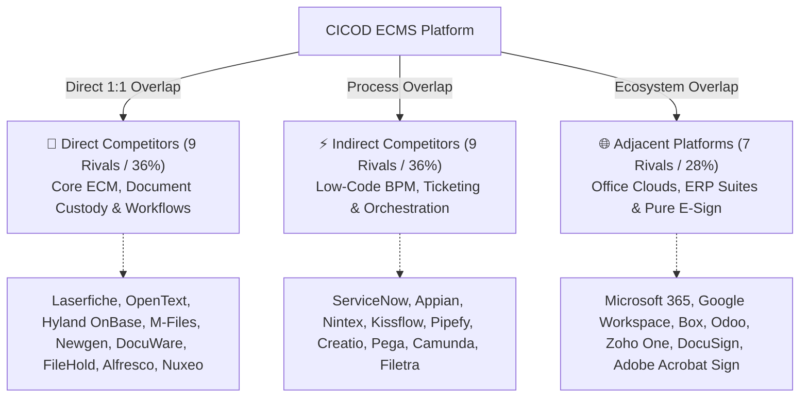

# ECMS Competitor Intelligence & Reference Directory

**Original Google Sheets Benchmark:** [Google Sheets: ECMS Competitor Analysis](https://docs.google.com/spreadsheets/d/1HgPinaeZGmwfwckh73KDxi6UJiFGsMDL/edit?usp=sharing&ouid=109902589367483496063&rtpof=true&sd=true)  
**Live Web Dashboard:** [`competitive_analysis/index.html`](file:///c:/Users/CI-STAFF/Documents/CICOD%20TEST/competitive_analysis/index.html) *(Local: `http://localhost:8899/index.html`)*

---

## Strategic Categorization: Direct, Indirect & Adjacent Competitors

---

### Tier 1: 🎯 Direct Competitors (9 Platforms — 36%)
*Architectural rivals whose primary product identity is Enterprise Content Management (ECM), document custody, records governance, and document-centric business process workflows. They directly compete for the master document repository budget.*

1. **Laserfiche:** [https://www.laserfiche.com](https://www.laserfiche.com)
   * *Archetype:* Enterprise Content Management & Electronic Forms
   * *Focus:* Deep document custody, web form designer, business process automation, records retention, and Laserfiche Connector no-code desktop scraping.
   * *ECMS Winning Angle:* 70% lower TCO, turnkey cloud onboarding in days vs. months, and native regional field operations dispatch.
2. **OpenText (Content Cloud & Extended ECM):** [https://www.opentext.com](https://www.opentext.com)
   * *Archetype:* Global Enterprise Heavyweight Content Services
   * *Focus:* Extended ECM, Core Content, Documentum, deep SAP S/4HANA Fiori and Salesforce integration, regulatory compliance archival, and Content Aviator GenAI.
   * *ECMS Winning Angle:* Massive price advantage (fraction of OpenText's 6-figure entry license) and frictionless deployment without armies of systems integrators.
3. **Hyland OnBase:** [https://www.hyland.com/en/products/onbase](https://www.hyland.com/en/products/onbase)
   * *Archetype:* Healthcare & Public Sector Enterprise ECM
   * *Focus:* Enterprise information platform, EHR integration (Epic/Cerner), transactional document lifecycle management, and public sector case processing.
   * *ECMS Winning Angle:* Modern responsive web UX, rapid multi-tenant SaaS deployment, and lightweight operational overhead.
4. **M-Files:** [https://www.m-files.com](https://www.m-files.com)
   * *Archetype:* Metadata-Driven Intelligent Information Management
   * *Focus:* Repository-neutral information management, Microsoft 365 SharePoint co-location, automated CRM metadata synchronization, and document approval workflows.
   * *ECMS Winning Angle:* Integrated operational case management with regional field task dispatch and native multi-party e-signing.
5. **Newgen Software (OmniDocs & OmniFlow):** [https://newgensoft.com](https://newgensoft.com)
   * *Archetype:* Core Banking ECM & Case Automation
   * *Focus:* Core banking customer dossiers (Finacle, Temenos), loan origination, insurance claims underwriting; dominant in African and Asian Tier-1 financial institutions.
   * *ECMS Winning Angle:* Agile no-code configuration, rapid SaaS onboarding, and disruptive pricing without multimillion-dollar licensing tiers.
6. **DocuWare:** [https://www.docuware.com](https://www.docuware.com)
   * *Archetype:* Cloud Document Management & Accounts Payable Automation
   * *Focus:* Cloud document management, automated invoice data capture (IDP), and pre-configured ERP matching workflows.
   * *ECMS Winning Angle:* Broader cross-departmental scope (HR, Public Sector, Higher Education) beyond back-office accounting.
7. **FileHold:** [https://www.filehold.com](https://www.filehold.com)
   * *Archetype:* Mid-Market Document Management System
   * *Focus:* Fast on-premises or private cloud deployment, version control, document review workflows, and regulatory audit trails.
   * *ECMS Winning Angle:* Modern user interface, visual forms builder, and integrated mobile field operations.
8. **Alfresco (Hyland Content Services):** [https://www.alfresco.com](https://www.alfresco.com)
   * *Archetype:* Open-Source Enterprise Content Services Platform
   * *Focus:* Customizable Java/CMIS document repository APIs, digital records management, and developer-friendly content services.
   * *ECMS Winning Angle:* Zero-code departmental empowerment; business managers build workflows without Java developers.
9. **Nuxeo (Hyland Content Platform):** [https://www.nuxeo.com](https://www.nuxeo.com)
   * *Archetype:* Cloud-Native Content Services & DAM
   * *Focus:* Cloud-native content services, digital asset management (DAM), and complex metadata schema handling.
   * *ECMS Winning Angle:* Pre-built turnkey operational workflows and native e-signatures that do not require custom development.

---

### Tier 2: ⚡ Indirect Competitors (9 Platforms — 36%)
*Platforms whose core strength is Business Process Management (BPM), low-code application development, and task/ticket orchestration. They handle the workflows and forms that ECMS manages, but lack full-lifecycle records custody and native legally-binding e-sign, typically relying on external cloud storage.*

1. **ServiceNow (Now Platform & Workflow):** [https://www.servicenow.com](https://www.servicenow.com)
   * *Archetype:* Enterprise Digital Workflows & ESM
   * *Focus:* IT Service Management (ITSM), HR service delivery, and IntegrationHub pre-built spokes.
   * *ECMS Winning Angle:* Native document vault custody and e-signing; ServiceNow is a ticketing engine, not an ECM repository.
2. **Appian:** [https://appian.com](https://appian.com)
   * *Archetype:* Enterprise Low-Code Automation & Data Fabric
   * *Focus:* High-end low-code process automation platform, unified data fabric, and complex mission-critical case management.
   * *ECMS Winning Angle:* 80% lower total cost of ownership; Appian requires six-figure annual software commitments.
3. **Nintex (Nintex Workflow & K2 Five):** [https://www.nintex.com](https://www.nintex.com)
   * *Archetype:* Visual Process Automation & Document Generation
   * *Focus:* Visual drag-and-drop process automation, document generation (DocGen), and digital signature routing.
   * *ECMS Winning Angle:* Integrated standalone platform without needing underlying Microsoft 365 enterprise licenses.
4. **Kissflow:** [https://kissflow.com](https://kissflow.com)
   * *Archetype:* Low-Code Digital Workplace & Procurement
   * *Focus:* Low-code process automation, internal procurement requests, ticket queues, and Zapier ecosystem.
   * *ECMS Winning Angle:* Full enterprise document repository (CICOD Drive) with version control, which Kissflow lacks.
5. **Pipefy:** [https://www.pipefy.com](https://www.pipefy.com)
   * *Archetype:* No-Code Kanban Workflow Management
   * *Focus:* No-code process orchestration, Kanban boards, Slack/Teams conversational approvals, and quick-start service desks.
   * *ECMS Winning Angle:* Enterprise compliance, audit-proof records management, and sovereign cloud infrastructure.
6. **Creatio (Studio Creatio):** [https://www.creatio.com](https://www.creatio.com)
   * *Archetype:* No-Code Composable CRM & BPM
   * *Focus:* No-code composable application platform combining CRM and business process workflows.
   * *ECMS Winning Angle:* Dedicated document custody, sovereign data residency, and heavy operational case routing.
7. **Pegasystems (Pega Infinity):** [https://www.pega.com](https://www.pega.com)
   * *Archetype:* Enterprise Decisioning & AI Case Management
   * *Focus:* Enterprise-grade decisioning and workflow automation, AI-driven case management for Fortune 500 banks and telcos.
   * *ECMS Winning Angle:* Rapid deployment and accessibility; Pega is notoriously complex, slow, and expensive.
8. **Camunda:** [https://camunda.com](https://camunda.com)
   * *Archetype:* Developer BPMN 2.0 Orchestration Engine
   * *Focus:* Developer-friendly BPMN 2.0 process orchestration for coordinating microservices, human workflows, and APIs.
   * *ECMS Winning Angle:* Complete turnkey business application: zero programming required for business managers to design forms.
9. **Filetra:** [https://www.filetra.com](https://www.filetra.com)
   * *Archetype:* Physical & Digital Records Tracking
   * *Focus:* Physical records management, RFID/barcode tracking, and specialized file dispatching.
   * *ECMS Winning Angle:* Comprehensive digital-first workflow lifecycle with integrated cloud Drive and digital signing.

---

### Tier 3: 🌐 Adjacent Competitors (7 Platforms — 28%)
*Incumbent platforms that organizations already own or purchase for other primary reasons (cloud storage, office collaboration, ERP, or standalone e-signatures) that overlap with specific ECMS modules.*

1. **Microsoft 365 (SharePoint & Power Automate):** [https://www.microsoft.com/en-us/microsoft-365](https://www.microsoft.com/en-us/microsoft-365)
   * *Archetype:* Ubiquitous Cloud Collaboration Suite
   * *Focus:* SharePoint document libraries, OneDrive storage, Power Automate workflow orchestration, and Teams.
   * *ECMS Winning Angle:* Structured SLA countdowns, public citizen form ingestion, and regional field operations dispatch.
2. **Google Workspace (Drive & AppSheet):** [https://workspace.google.com](https://workspace.google.com)
   * *Archetype:* Real-Time Cloud Collaboration & Office Suite
   * *Focus:* Google Drive cloud storage, Google Docs/Sheets collaboration, and AppSheet no-code mobile apps.
   * *ECMS Winning Angle:* True enterprise document archival, audit certificates, multi-tier approval escalations & legal e-sign.
3. **Box (Box Enterprise & Box Sign):** [https://www.box.com](https://www.box.com)
   * *Archetype:* Cloud Content Management & Integrated E-Sign
   * *Focus:* Secure cloud content management, Box Relay workflow automation, Box Sign, and Salesforce integration.
   * *ECMS Winning Angle:* End-to-end operational ticketing, case escalation timers, and field workforce management.
4. **Odoo Enterprise (Documents, Sign & Studio):** [https://www.odoo.com](https://www.odoo.com)
   * *Archetype:* Modular Open-Source ERP Suite
   * *Focus:* Integrated open-source ERP, native document management, built-in e-signature, and accounting sync.
   * *ECMS Winning Angle:* Superior dedicated workflow orchestration, citizen web forms, and regional geographic territory routing.
5. **Zoho One (Zoho Creator, Sign & Flow):** [https://www.zoho.com/one/](https://www.zoho.com/one/)
   * *Archetype:* All-in-One SMB Business Operating System
   * *Focus:* 45+ integrated SaaS applications, affordable cross-functional automations, and Zoho Sign.
   * *ECMS Winning Angle:* Tailored public sector MDAs and enterprise compliance with sovereign data hosting and SLA timers.
6. **DocuSign (DocuSign IAM & eSignature):** [https://www.docusign.com](https://www.docusign.com)
   * *Archetype:* Dedicated Agreement Cloud & E-Signature
   * *Focus:* Global standard in electronic signature, Contract Lifecycle Management (CLM), and IAM.
   * *ECMS Winning Angle:* Native e-signing included in core platform subscription with zero envelope limits or add-on penalties.
7. **Adobe Acrobat Sign (Adobe Document Cloud):** [https://www.adobe.com/sign.html](https://www.adobe.com/sign.html)
   * *Archetype:* Enterprise PDF Ecosystem & Digital Signatures
   * *Focus:* Enterprise PDF ecosystem, legal electronic and digital certificate signatures (eIDAS/AATL), and Workday sync.
   * *ECMS Winning Angle:* Full operational case workflows and unified document management without paying separate PDF licenses.