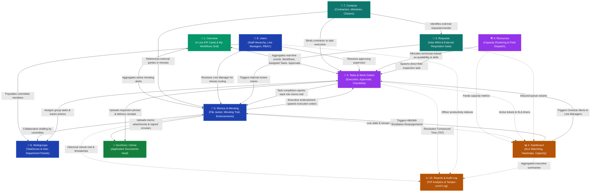

# Gov ECMS Architecture: Modern Next.js Portal (`/ecms/`) vs. Legacy (`/wfm/`) & Full Interconnection Blueprint
## Deep-Dive Analysis of 1Gov ECMS & Transformation to CICOD Workflow (`cFlow`)

---

## 1. Executive Overview: Evolution of Gov ECMS

The **Government Electronic Content & Memo Management System (Gov ECMS)** is the digital nervous system for civil service operations. It replaces physical paper file jackets, loose circulars, and unmonitored email threads with an automated, trackable, and accountable digital workflow.

In the 1Government platform, there are two co-existing interfaces:
1. **The Legacy PHP/Yii Engine (`/wfm/`)**: The original backend workflow engine (`govtest.convergenceondemand.com/wfm/`), which powered the foundational 8 modules.
2. **The Modern Next.js Paperless Service Portal (`/ecms/`)**: The brand-new modernized frontend (`govtest.convergenceondemand.com/ecms/overview`), featuring an expanded, streamlined sidebar with **10 primary modules** and an executive command center. Notably, the new portal displays a banner link: `↗ Visit the old ECMS page`, pointing back to `/wfm/`.

---

### Comparative Sidebar Matrix: Legacy WFM vs. Modern Next.js ECMS

| # | Legacy ECMS (`/wfm/`) | Modern Next.js ECMS (`/ecms/`) | Type | Key Evolution & Capabilities |
|---|:---|:---|:---|:---|
| **1** | *(No standalone Overview)* | 🔲 **Overview** (`/ecms/overview`) | Direct Link | **New Executive Command Center**: 4 real-time KPI cards (*My Workflows*, *Tasks Assigned To Me*, *Tasks Awaiting My Approval*, *My Notifications*) + interactive *My Workflows* grid (*Nigeria*, *Complaints*, *1Gov test*). |
| **2** | 📊 **Dashboard** (`<`) | 📊 **Dashboard** (`>`) | Expandable | Deep performance analytics, SLA watchdog, and department utilization heatmaps. |
| **3** | 📄 **Request** | 📄 **Requests** | Direct Link | Inbound statutory inter-agency requisitions & external stakeholder intake. |
| **4** | 📑 **Tasks** (`<`) | 📑 **Tasks** (`>`) | Expandable | Operational work orders, ticket execution, supervisory approvals, and starred items. |
| **5** | 📝 **Memo** (`<`) | 📝 **Memos** (`>`) | Expandable | Official electronic file jackets, chronological minute trails, and executive endorsements. |
| **6** | 👥 **Workgroup** (`<`) | 👥 **Workgroups** | Direct Link | Cross-departmental taskforces, probe committees, and inter-ministerial squads. |
| **7** | 📋 **Templates** (`<`) | *(Moved under Memos / Settings)* | Submenu | Standardized public service circular layouts, letterheads, and gazettes. |
| **8** | 👤 **Contacts** | 👤 **Contacts** | Direct Link | Accredited government contractor directory, institutional registry, and CRM logs. |
| **9** | *(Hidden in Admin settings)* | 👤 **Users** (`>`) | **NEW MODULE** | **Staff & Hierarchy Directory**: Line manager tree, departmental rosters, role permissions, and approval delegation. |
| **10**| *(Hidden in Admin settings)* | 🛠️ **Resources** (`>`) | **NEW MODULE** | **Capacity & Field Dispatch**: Technician rostering, skills matrix, regional dispatch zones, and workload balancing. |
| **11**| 📈 **Reports** (`<`) | 📈 **Reports** (`>`) | Expandable | Retrospective turnaround time (TAT), SLA breach audits, and forensic audit logs. |

---

### The Modernized Sidebar Structure (`/ecms/overview`)

```
 1. 🔲 Overview                   (/ecms/overview)
 2. 📊 Dashboard (>)              (/ecms/dashboard)
 3. 📄 Requests                   (/ecms/requests)
 4. 📑 Tasks (>)                  (/ecms/tasks)
 5. 📝 Memos (>)                  (/ecms/memos)
 6. 👥 Workgroups                 (/ecms/workgroups)
 7. 👤 Contacts                   (/ecms/contacts)
 8. 👤 Users (>)                  (/ecms/users)          [NEW FIRST-CLASS MODULE]
 9. 🛠️ Resources (>)              (/ecms/resources)      [NEW FIRST-CLASS MODULE]
 10. 📈 Reports (>)               (/ecms/reports)

── Help & Support ──
 ⓘ Get Support
 🌐 Start Tour

── Settings ──
 ⚙️ Preferences
 🚪 Log out
```
---

## 2. Deep Dive: The 10 Modern Modules & Sub-Functions

Below is a detailed breakdown of each of the 10 first-class modules present in the modernized Next.js Gov ECMS portal (`/ecms/`):

### 2.1 Module 1: Overview (`🔲 Overview`)
* **Core Purpose**: The modern executive landing page (`/ecms/overview`) providing instant situational awareness upon login.
* **Key Features in the New Next.js App**:
  1. **4 Real-Time KPI Cards**:
     - 🟢 **My Workflows** (e.g. `4 Active Workflows`)
     - 🔵 **Tasks Assigned To Me** (e.g. `13 Tasks`)
     - 🟠 **Tasks Awaiting My Approval** (e.g. `8 Tasks`)
     - 🟣 **My Notifications** (e.g. `20 Unread Alerts`)
  2. **My Workflows Interactive Grid**: Direct cards for mapped queues (`Nigeria (Abuja)`, `Complaints (Account set up complaints)`, `1Gov test (Gov Test QT)`) showing completion percentages and task counts.
  3. **Action Shortcuts**: `+ Quick Actions` button, `Starred Tasks`, and `All Tasks` filters.

### 2.2 Module 2: Dashboard (`📊 Dashboard >`)
* **Core Purpose**: Deep analytics, SLA escalation heatmaps, and performance monitoring.
* **Sub-Modules**:
  1. **Overview (`/ecms/dashboard/overview`)**: High-level statistical summaries.
  2. **Workflow Dashboard (`/ecms/dashboard/workflows`)**: Case velocity across pipeline stages.
  3. **Status & Escalation Dashboard (`/ecms/dashboard/escalations`)**: Active SLA watchdog tracking files nearing breach (48h/96h matrix).
  4. **Resource Utilization (`/ecms/dashboard/resources`)**: Departmental staff capacity and dispatch metrics.

### 2.3 Module 3: Requests (`📄 Requests`)
* **Core Purpose**: Formal boundary gate for external stakeholder intake and inter-agency requisitions.
* **Functionality**:
  - Receives formal submissions from other MDAs, citizens, or accredited contractors.
  - Acts as the intake queue where officers verify documents before creating internal Memos or operational Tasks.

### 2.4 Module 4: Tasks (`📑 Tasks >`)
* **Core Purpose**: Tactical execution, assignment tracking, and work-order management.
* **Sub-Modules**:
  1. **Create Task**: Dispatches an actionable ticket to a specific staff member or department queue.
  2. **Task Approvals**: Supervisory verification gate where Line Managers inspect deliverables before closure.
  3. **Starred Tasks**: Priority work orders pinned by the user.
  4. **All Tasks**: Filterable operational registry.

### 2.5 Module 5: Memos (`📝 Memos >`)
* **Core Purpose**: Digital minuting, policy authoring, and executive governance.
* **Functionality**:
  - Replaces paper file jackets with an immutable chronological minute trail (Desk Officer ➔ Assistant Director ➔ Permanent Secretary).
* **Sub-Modules**:
  1. **Create Memo**: Drafting official memos with linked templates and file attachments.
  2. **View All Memos**: Master docket registry.
  3. **Memo Drafts**: Unsubmitted working drafts.
  4. **Draft Reviews**: Collaborative pre-dispatch review by Legal or Co-Authors.

### 2.6 Module 6: Workgroups (`👥 Workgroups`)
* **Core Purpose**: Collaborative spaces for inter-departmental taskforces and probe committees.
* **Functionality**:
  - Assembles cross-directorate teams (e.g., *Tender Board Panel*, *Asset Audit Task Force*).
  - Unifies Memos, Tasks, and GovDrive documents under a single group charter.

### 2.7 Module 7: Contacts (`👤 Contacts`)
* **Core Purpose**: Authoritative directory of citizens, contractors, vendors, and institutional entities.
* **Functionality**:
  - Maintains master profiles: Tax ID (TIN), registered address, verified contact persons, and lifetime engagement history.

### 2.8 Module 8: Users (`👤 Users >`) [CONFIRMED LIVE ARCHITECTURE]
* **Core Purpose**: Organizational establishment tree, staff directory, and line-manager governance.
* **Sub-Modules**:
  1. **Departments (`/ecms/users/departments`)**:
     - **Civil Service Structure**: Maps personnel to ministerial directorates (e.g. *Finance & Accounts [DFA]*, *Works & Infrastructure*, *Planning, Research & Statistics [PRS]*, *Procurement & Tenders*, *Legal Services*).
     - **Line Manager & Minuting Hierarchy**: Establishes administrative reporting lines: Desk Officer ➔ Assistant Director ➔ Director / Head of Department (HOD) ➔ Permanent Secretary.
     - **Delegation Authority**: Allows supervisors to reassign approval authority and minute routing during officer leaves or administrative reshuffles.
* **Commercial Enterprise Enhancement (`cFlow`)**:
  - **Matrix Organization & Pods**: Commercial businesses operate in agile matrices. Employees belong to a functional department (e.g. Engineering) while dynamically staffed into cross-functional *Product Pods* or *Deal Teams* (e.g. "Fintech Mobile App Launch", "Series B M&A").
  - **Tiered CapEx/OpEx Approval Thresholds**: Approvals scale dynamically by transaction value (e.g. &lt;₦1M = Team Lead, &lt;₦10M = Director, &gt;₦10M = CFO/CEO).
  - **Automated OOO Delegation & SCIM Sync**: Active Directory / Okta SCIM 2.0 provisioning with automated temporary surrogate delegation when managers are out of office.

### 2.9 Module 9: Resources (`🛠️ Resources >`) [CONFIRMED LIVE ARCHITECTURE]
* **Core Purpose**: Workforce capacity management, skills classification, shift rostering, and operational field dispatch.
* **Sub-Modules**:
  1. **Resource Type (`/ecms/resources/type`)**:
     - Classifies technical workforce and equipment capabilities (e.g. *Civil & Structural Field Inspector*, *Electrical & High-Voltage Specialist*, *Environmental Impact Assessor*, *Statutory Minuting Analyst*, *Quantity Surveyor*).
     - Tags personnel with mandatory regulatory licenses (e.g. COREN, NIQS, Legal Bar) and maximum caseload limits (e.g. 4 active inspections per officer).
  2. **Resource Shift (`/ecms/resources/shift`)**:
     - Defines operational working hours and duty rosters tied directly to automated SLA countdown timers:
       - *Standard Public Service Shift (Core)*: 08:00 — 16:00 (Mon–Fri) — Benchmark: 48h Tier 1 / 96h Tier 2 escalation.
       - *After-Hours Executive Minuting*: 16:00 — 22:00 (Mon–Fri) — Fast-track 12h max turnaround.
       - *24/7 Field & Emergency Response*: 3 rotational 8-hour blocks — Strict 2-hour emergency response SLA.
  3. **Resource Schedule (`/ecms/resources/schedule`)**:
     - Real-time Gantt timeline rostering showing officer on-duty status, active work order queues, and capacity utilization meters.
     - Prevents officer burnout and ensures work orders are dispatched only to on-duty, available personnel.
* **Commercial Enterprise Enhancement (`cFlow`)**:
  - **Billable Roles & Subcontractor Margins**: Resource Types incorporate client billing rates ($/hr), internal cost rates, and external vendor SOW tracking for automated client invoicing.
  - **Follow-the-Sun 24/7 Global Shifts**: Multi-timezone shift handoffs (EMEA ➔ Americas ➔ APAC) with automated ticket context handovers so customer SLA countdowns never stall.
  - **AI-Powered Smart Dispatch Assistant**: Algorithmic matching of incoming tickets against certified skill tags, active shift schedule right now, geographic proximity (GPS), and lowest current caseload.
  - **Two-Way Calendar Sync**: Direct bi-directional integration with Microsoft Outlook 365 and Google Calendar.

### 2.10 Module 10: Reports (`📈 Reports >`)
* **Core Purpose**: Retrospective compliance analytics, officer performance audits, and immutable forensic logging.
* **Sub-Modules**:
  1. **Reports Analytics**: Turnaround Time (TAT) analytics, department throughput, and SLA compliance rankings.
  2. **Audit Log**: Tamper-proof forensic timeline of every login, minute, approval, and file access with IP signatures.

---

## 3. How All 10 Modules are Interconnected

The modern Gov ECMS operates as an interconnected, closed-loop operating system:



---

## 4. End-to-End Operational Lifecycle Walkthrough

To demonstrate how data flows through all 10 modern modules, consider a real-world **Inter-Agency Infrastructure & Procurement Lifecycle**:

```
[Overview: 4 Live KPIs]
        │
[Contacts Registry] ──► [Requests Gate] ──► [GovDrive Vault]
                                │
[Users: Line Manager Tree] ────► [Memos & Minuting Trail] ◄──► [Workgroups]
                                │
[Resources: Capacity/Skills] ──► [Tasks & Work Orders] ──► [GovDrive Vault]
                                │
[Dashboard: SLA Watchdog (48h/96h)]
                                │
[Reports: TAT & Forensic Audit Log]
```

1. **Intake & Initiation (`Contacts` + `Requests`)**:
   - An external contractor (*Julius Berger*) submits an official engineering clearance requisition through **Requests (`#3`)**.
   - The system checks the **Contacts (`#7`)** registry to verify the contractor's credentials, tax clearance (TIN), and CAC registration.
   - Attachments are automatically archived to **GovDrive** under `Application Documents > ECMS > Queues > Request Token > Files`.
2. **Staff Hierarchy & Minuting (`Users` + `Memos`)**:
   - The Request is accepted and automatically generates an official **Memo (`#5`)**: *Ref: FMW/PRS/2026/044 - Expressway Bridge Clearance*.
   - The **Users (`#8`)** module resolves the reporting hierarchy:
     - Desk Officer authors Minute 1 (Technical assessment).
     - The line manager tree routes it to Assistant Director for Minute 2 (Statutory recommendation).
     - The Permanent Secretary reviews and applies Minute 3 (Executive Endorsement).
3. **Cross-Departmental Collaboration (`Workgroups`)**:
   - To supervise the inter-ministerial scope, a joint **Workgroup (`#6`)** is formed: *Bridge Safety Taskforce* (linking Works, Environment, and Federal Highway Safety officers).
   - All committee members view and annotate the shared Memo, drawings, and environmental impact assessments.
4. **Smart Dispatch & Capacity Allocation (`Resources` + `Tasks`)**:
   - Upon the Permanent Secretary's memo approval, the workflow automatically instantiates operational **Tasks (`#4`)**:
     - Task 1: Structural load-bearing test (Assigned to Senior Structural Engineer).
     - Task 2: Right-of-way corridor inspection.
     - Task 3: Final safety certificate sign-off (Sent to `Task Approvals`).
   - The **Resources (`#9`)** engine checks engineer rosters, certifications (COREN license), geographic dispatch zones (Abuja Central), and current active workload to assign the task without overloading personnel.
5. **Real-Time Operational Cockpit (`Overview` + `Dashboard`)**:
   - The assigned engineer sees the task in **Overview (`#1`)** under *Tasks Assigned To Me* (badge counter incremented to `14`).
   - The Director tracks operational progress via the **Dashboard (`#2`)**. If Task 1 remains uninspected for 48 hours, the **SLA Watchdog** flags the task amber; at 96 hours, it triggers automated line-manager escalation.
6. **Compliance, TAT & Forensic Accountability (`Reports`)**:
   - Once all tasks are completed and signed off via `Task Approvals`, **Reports (`#10`)** calculates the turnaround time (TAT: 4.8 days, 92% SLA compliance).
   - The **Audit Log** commits an immutable, timestamped ledger of every officer who accessed the file, every minute penned, and all digital approvals with cryptographic signatures.

---

## 5. White-Labeling & Commercial Enterprise Tailoring (`cFlow`)

In commercial SaaS / B2B enterprise deployments, Gov ECMS transforms into **CICOD Workflow (`cFlow`)**:

| Modern Gov ECMS Module | Commercial `cFlow` Equivalent | Enterprise Commercial Capabilities |
| :--- | :--- | :--- |
| **1. Overview** | **Mission Control Homepage** | Real-time cockpit showing active workflows, assigned tasks, awaiting approvals, and notifications with 1-click filters. |
| **2. Dashboard** (`>`) | **Executive KPI Command Center** | Real-time C-suite pipeline monitor, case volumes, SLA heatmaps, and team bandwidth. |
| **3. Requests** | **B2B Requisitions & Intake Gate** | Direct customer inquiry portal, cross-company supplier requisitions, and vendor quoting. |
| **4. Tasks** (`>`) | **Business Process Tasks & Work Orders** | Operational checklists, engineering dispatches, customer onboarding steps, and line manager sign-offs. |
| **5. Memos** (`>`) | **Corporate Memos & Digital Minuting** | Executive CapEx authorizations, budget releases, board approvals, and track-changes threads. |
| **6. Workgroups** | **Project Pods & Deal Teams** | Agile squads, M&A due diligence teams, and cross-functional product squads sharing document pools. |
| **7. Contacts** | **Customer & Vendor CRM Registry** | Unified account directory, supplier KYC records, client contact histories, and linked case tickets. |
| **8. Users** (`>`)<br>• `Departments` | **Organization, Divisions & Pods**<br>• `Departments & Agile Pods` | Matrix organization structure combining functional homes (Engineering, Legal, Finance) with cross-functional product pods. Dynamic CapEx/OpEx authorization matrix based on financial thresholds (&lt;₦1M, &lt;₦10M, &gt;₦10M) with automated out-of-office delegation. |
| **9. Resources** (`>`)<br>• `Resource Type`<br>• `Resource Shift`<br>• `Resource Schedule` | **Workforce & Capacity Management**<br>• `Billable Roles & Skills Matrix`<br>• `24/7 Follow-the-Sun Shifts`<br>• `AI Dispatch & Capacity Planner` | **Resource Types**: Tracks billable rates ($/hr), subcontractor vendor SOWs, and margins.<br>**Resource Shifts**: 24/7 Follow-the-Sun shift handoffs across EMEA, Americas, and APAC with zero SLA downtime.<br>**Resource Schedule**: Interactive Gantt capacity planner with AI-powered Smart Dispatch matching certified skills, active shift status, and workload balance. |
| **10. Reports** (`>`) | **Enterprise Analytics & SOC 2 Audit** | Turnaround Time (TAT) analytics, staff utilization indexes, and immutable SOC 2 / NDPR forensic audit logs. |

---

## 6. Implementation References

* **Interactive cFlow Application**: [cflow.html](file:///c:/Users/CI-STAFF/Documents/CICOD/cflow.html) (Features live dual-mode switching between Commercial `cFlow` and Government `Gov ECMS` with full expandable submenus).
* **Enterprise Architecture Suite**: [gov_architecture.html](file:///c:/Users/CI-STAFF/Documents/CICOD/gov_architecture.html).
* **Use Cases & Blueprint**: [usecases.html](file:///c:/Users/CI-STAFF/Documents/CICOD/usecases.html) (Interactive sidebar mapper linking each Gov module to its commercial counterpart).
